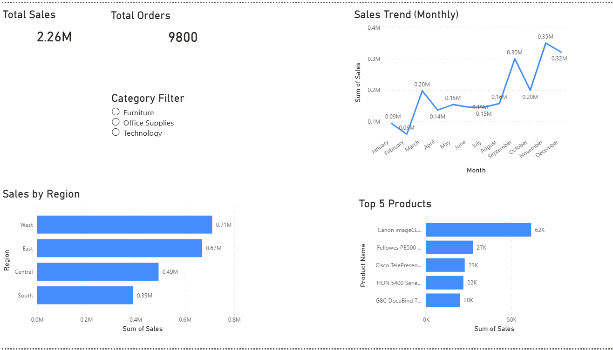
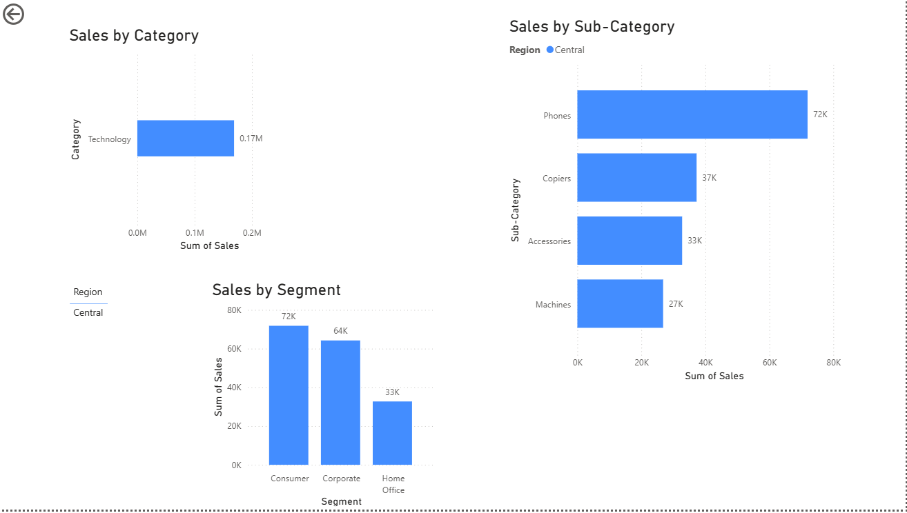
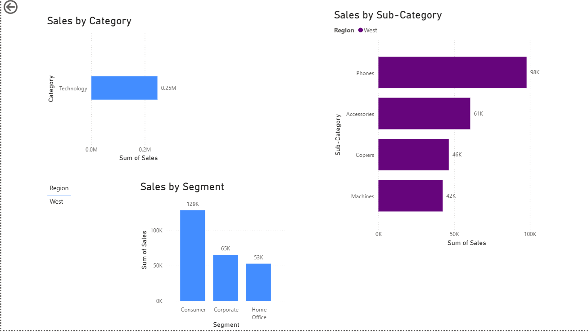

# 📊 Sales Analytics Dashboard (Power BI)

## 🔍 Overview
A multi-page interactive Power BI dashboard with drill-through functionality was developed to enable both high-level monitoring and detailed analysis of sales performance.

## 🛠️ Tools Used
- Power BI
- Python (Pandas)
- CSV Dataset

## 📈 Features
- KPI Cards (Total Sales, Total Orders)
- Sales Trend Analysis (Monthly)
- Sales by Region
- Top 5 Products
- Category & Segment Analysis
- Interactive Slicers
- Drill-through functionality

## 📸 Dashboard Preview

### Overview Page

### Detailed Analysis Page

### Drill-through View

## 📌 Key Insights
- West region generates highest revenue
- Consumer segment contributes most sales
- Sales show seasonal trends
- Top products drive significant revenue

## 🚀 Conclusion
This dashboard helps in understanding business performance and supports data-driven decisions.# SalesAnalytics-Dashboard
